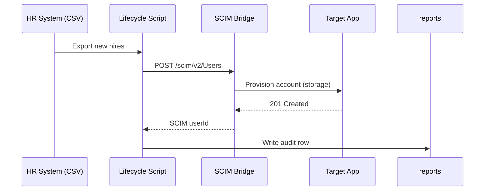

# IAM Portfolio Upgrade – 7‑Day Sprint Pack

This pack gives you a **multi‑vendor, testable, and releasable** IAM portfolio you can paste into GitHub today. Copy the structure, drop files in, and commit.

---

## 📁 Repository Layout

```
IAM-ENGINEERING-PORTFOLIO/
├─ README.md
├─ docs/
│  ├─ flows.md
│  └─ audit-sample.md
├─ services/
│  └─ scim-bridge/           # Minimal SCIM 2.0 microservice (Python + FastAPI)
│     ├─ app.py
│     ├─ models.py
│     ├─ storage.py
│     ├─ requirements.txt
│     ├─ .env.example
│     └─ tests/
│        └─ test_users.py
├─ powershell/
│  └─ PasswordRotation/      # Ship as a PowerShell module with tests
│     ├─ PasswordRotation.psd1
│     ├─ PasswordRotation.psm1
│     ├─ examples/
│     │  └─ Rotate-ServiceAccounts.ps1
│     └─ tests/
│        └─ PasswordRotation.Tests.ps1
├─ iac/
│  └─ entra_app/
│     ├─ main.tf
│     ├─ variables.tf
│     └─ outputs.tf
├─ .github/
│  └─ workflows/
│     └─ ci.yml
├─ reports/
│  └─ password_rotation_report.sample.csv
└─ mkdocs.yml
```

---

## README.md (Top‑level)

```markdown
# IAM Engineering Portfolio

Hands‑on, runnable IAM labs and tools across Microsoft Entra, Okta‑style SCIM, and Terraform. Each lab ships with tests, CI, and an artifact you can show in interviews.

## Quick Start
- **SCIM service:** `cd services/scim-bridge && python -m venv .venv && . .venv/bin/activate && pip install -r requirements.txt && cp .env.example .env && uvicorn app:app --reload`
- **PowerShell module:** `Import-Module ./powershell/PasswordRotation/PasswordRotation.psd1` then run the example in `examples/Rotate-ServiceAccounts.ps1`.
- **Terraform (Entra App Reg demo):** `cd iac/entra_app && terraform init && terraform apply -var app_name="demo-scim-client"`

## What to Click (Demo Artifacts)
| Lab | Problem | Result Artifact |
|---|---|---|
| Password Rotation | Rotate service account passwords + export audit trail | `reports/password_rotation_report.sample.csv` |
| SCIM 2.0 Service | CRUD Users for provisioning demos | `services/scim-bridge/tests/test_users.py` (green) + live API |
| Entra App Reg (IaC) | App registrations tracked in code | Terraform state + outputs |

## Diagrams
See `docs/flows.md` for end‑to‑end Joiner → SCIM → Target flow.

## Compliance Mapping
Highlights for **NIST 800‑53**: AC‑2 (Account Mgmt), IA‑2 (AuthN), CM‑2 (Baseline Config), AU‑2 (Auditable events). See `docs/audit-sample.md`.

## License
MIT
```

---

## docs/flows.md

```markdown
# Flows


```

---

## docs/audit-sample.md

```markdown
# Audit Trail (Sample)
- **Run ID:** 2025-08-29T12:00:00Z
- **Operator:** CI (GitHub Actions)
- **Scope:** 43 users processed, 5 rotated, 0 failures
- **Artifacts:** `reports/password_rotation_report.sample.csv`
```

---

## services/scim-bridge/.env.example

```env
# Token used for simple Bearer auth
API_TOKEN=change-me
```

## services/scim-bridge/requirements.txt

```
fastapi
uvicorn
pydantic
pytest
python-dotenv
```

## services/scim-bridge/storage.py

```python
from typing import Dict

class InMemoryStore:
    def __init__(self):
        self.users: Dict[str, dict] = {}

    def list_users(self):
        return list(self.users.values())

    def get(self, uid: str):
        return self.users.get(uid)

    def put(self, uid: str, data: dict):
        self.users[uid] = data
        return data

    def delete(self, uid: str):
        return self.users.pop(uid, None)
```

## services/scim-bridge/models.py

```python
from pydantic import BaseModel
from typing import Optional

class Name(BaseModel):
    givenName: str
    familyName: str

class User(BaseModel):n    id: Optional[str] = None
    userName: str
    name: Name
    active: bool = True
```

## services/scim-bridge/app.py

```python
import os, uuid
from fastapi import FastAPI, Header, HTTPException
from dotenv import load_dotenv
from models import User
from storage import InMemoryStore

load_dotenv()
TOKEN = os.getenv("API_TOKEN", "change-me")
app = FastAPI(title="SCIM Bridge")
store = InMemoryStore()

def auth(bearer: str):
    if bearer != f"Bearer {TOKEN}":
        raise HTTPException(status_code=401, detail="Unauthorized")

@app.get("/scim/v2/ServiceProviderConfig")
async def spc():
    return {"authenticationSchemes": [{"type": "oauthbearertoken"}], "patch": {"supported": True}}

@app.get("/scim/v2/Users")
async def list_users(authorization: str = Header(None)):
    auth(authorization)
    return {"Resources": store.list_users(), "totalResults": len(store.list_users())}

@app.post("/scim/v2/Users")
async def create_user(u: User, authorization: str = Header(None)):
    auth(authorization)
    uid = u.id or str(uuid.uuid4())
    data = u.dict(); data["id"] = uid
    store.put(uid, data)
    return data

@app.get("/scim/v2/Users/{uid}")
async def get_user(uid: str, authorization: str = Header(None)):
    auth(authorization)
    u = store.get(uid)
    if not u:
        raise HTTPException(404, "Not Found")
    return u

@app.delete("/scim/v2/Users/{uid}")
async def delete_user(uid: str, authorization: str = Header(None)):
    auth(authorization)
    removed = store.delete(uid)
    if not removed:
        raise HTTPException(404, "Not Found")
    return {"id": uid, "deleted": True}
```

## services/scim-bridge/tests/test_users.py

```python
from fastapi.testclient import TestClient
from app import app, TOKEN

client = TestClient(app)
headers = {"Authorization": f"Bearer {TOKEN}"}

def test_create_and_list_user():
    payload = {"userName": "jdoe","name": {"givenName": "John","familyName": "Doe"}}
    r = client.post("/scim/v2/Users", json=payload, headers=headers)
    assert r.status_code == 200
    uid = r.json()["id"]
    r = client.get("/scim/v2/Users", headers=headers)
    assert r.status_code == 200 and r.json()["totalResults"] >= 1
    r = client.get(f"/scim/v2/Users/{uid}", headers=headers)
    assert r.status_code == 200 and r.json()["userName"] == "jdoe"
```

---

## powershell/PasswordRotation/PasswordRotation.psd1

```powershell
@{
    RootModule        = 'PasswordRotation.psm1'
    ModuleVersion     = '0.1.0'
    GUID              = '7c7a8a2a-8f12-4b7b-8d5b-1e3e1c0f4b2a'
    Author            = 'Your Name'
    Description       = 'Service account password rotation with audit output.'
    PowerShellVersion = '7.0'
    FunctionsToExport = @('Invoke-PasswordRotation')
}
```

## powershell/PasswordRotation/PasswordRotation.psm1

```powershell
function Invoke-PasswordRotation {
    [CmdletBinding()] param(
        [Parameter(Mandatory)] [string] $InputCsvPath,
        [Parameter(Mandatory)] [string] $ReportCsvPath
    )
    $accounts = Import-Csv -Path $InputCsvPath
    $results = @()
    foreach ($acct in $accounts) {
        # DEMO: generate a fake password; replace with CyberArk/Delinea API calls
        $new = [System.Web.Security.Membership]::GeneratePassword(16,3)
        $results += [pscustomobject]@{
            Timestamp = (Get-Date).ToString('o')
            Account   = $acct.Name
            Status    = 'Rotated'
            NewSecret = $new
        }
    }
    $results | Export-Csv -NoTypeInformation -Path $ReportCsvPath
    Write-Output $results
}
```

## powershell/PasswordRotation/examples/Rotate-ServiceAccounts.ps1

```powershell
Import-Module (Join-Path $PSScriptRoot '..' 'PasswordRotation.psd1')
$in  = Join-Path $PSScriptRoot 'service-accounts.sample.csv'
$out = Join-Path $PSScriptRoot '..' '..' '..' 'reports' 'password_rotation_report.sample.csv'
Invoke-PasswordRotation -InputCsvPath $in -ReportCsvPath $out | Format-Table
```

## powershell/PasswordRotation/tests/PasswordRotation.Tests.ps1

```powershell
Import-Module "$PSScriptRoot/../PasswordRotation.psd1"
Describe 'Invoke-PasswordRotation' {
  It 'creates a CSV report and outputs objects' {
    $tmpIn  = New-Item -ItemType File -Path (Join-Path $env:TEMP 'accts.csv') -Force
    @"Name
svc_sql
svc_web
"@ | Set-Content $tmpIn
    $tmpOut = Join-Path $env:TEMP 'report.csv'
    $o = Invoke-PasswordRotation -InputCsvPath $tmpIn -ReportCsvPath $tmpOut
    Test-Path $tmpOut | Should -BeTrue
    $o.Count | Should -BeGreaterThan 0
  }
}
```

## reports/password_rotation_report.sample.csv

```csv
Timestamp,Account,Status,NewSecret
2025-08-29T12:00:00Z,svc_sql,Rotated,REDACTED
```

---

## iac/entra_app/main.tf

```hcl
terraform {
  required_providers {
    azuread = { source = "hashicorp/azuread" version = ">= 2.47.0" }
  }
}

provider "azuread" {}

resource "azuread_application" "app" {
  display_name = var.app_name
}

resource "azuread_service_principal" "sp" {
  application_id = azuread_application.app.application_id
}

output "app_object_id" { value = azuread_application.app.id }
output "sp_object_id"  { value = azuread_service_principal.sp.id }
```

## iac/entra_app/variables.tf

```hcl
variable "app_name" { type = string }
```

## iac/entra_app/outputs.tf

```hcl
output "application_id" { value = azuread_application.app.application_id }
```

---

## .github/workflows/ci.yml

```yaml
name: CI
on: [push, pull_request]
jobs:
  powershell:
    runs-on: ubuntu-latest
    steps:
      - uses: actions/checkout@v4
      - name: Install PowerShell
        uses: PowerShell/PowerShell@v1
        with: { pwsh-version: '7.4.x' }
      - name: PSScriptAnalyzer
        run: |
          pwsh -Command "Install-Module PSScriptAnalyzer -Scope CurrentUser -Force; Invoke-ScriptAnalyzer -Path ./powershell/PasswordRotation -Recurse -Severity Information"
      - name: Pester tests
        run: |
          pwsh -Command "Install-Module Pester -Scope CurrentUser -Force; Invoke-Pester -Path ./powershell/PasswordRotation/tests -CI"

  python:
    runs-on: ubuntu-latest
    steps:
      - uses: actions/checkout@v4
      - uses: actions/setup-python@v5
        with: { python-version: '3.x' }
      - name: Install
        run: |
          pip install -r services/scim-bridge/requirements.txt
      - name: Pytest
        run: |
          python -m pytest -q services/scim-bridge/tests

  terraform:
    runs-on: ubuntu-latest
    steps:
      - uses: actions/checkout@v4
      - uses: hashicorp/setup-terraform@v3
      - name: Terraform init & validate
        working-directory: iac/entra_app
        run: |
          terraform init -input=false
          terraform validate
```

---

## mkdocs.yml (Optional Docs Site)

```yaml
site_name: IAM Engineering Portfolio
nav:
  - Home: README.md
  - Flows: docs/flows.md
  - Audit: docs/audit-sample.md
theme: readthedocs
```

---

## 7‑Day Sprint Plan (Do this next)

**Day 1:** Create repo with this structure. Commit README + PowerShell module skeleton.

**Day 2:** Finish PasswordRotation example + test; generate sample CSV report and commit.

**Day 3:** Add CI workflow; ensure green build (Pester + Pytest pass).

**Day 4:** Stand up SCIM Bridge locally; run tests; record a 60‑sec demo GIF.

**Day 5:** Add Terraform app reg; commit `terraform apply` outputs to README.

**Day 6:** Write `docs/flows.md` Mermaid diagram + `docs/audit-sample.md`.

**Day 7:** Cut **Release v0.1** with CHANGELOG (what changed, what works), add repo topics, and share on LinkedIn.

---

## Notes & Customization
- Swap the in‑memory store for SQLite when ready.
- Replace the fake password generator with CyberArk/Delinea API calls.
- Add Okta event hooks → small webhook receiver (FastAPI) + send to ELK/Splunk as a next lab.

